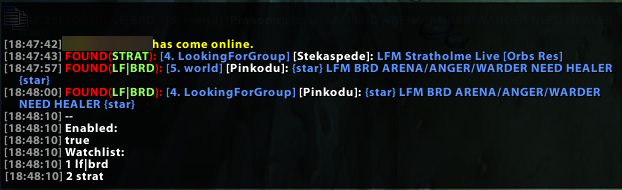
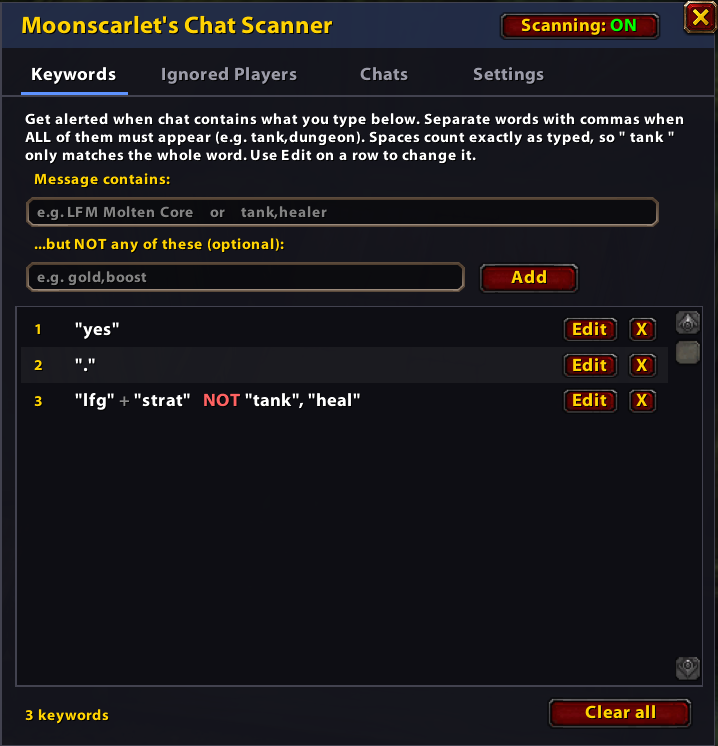
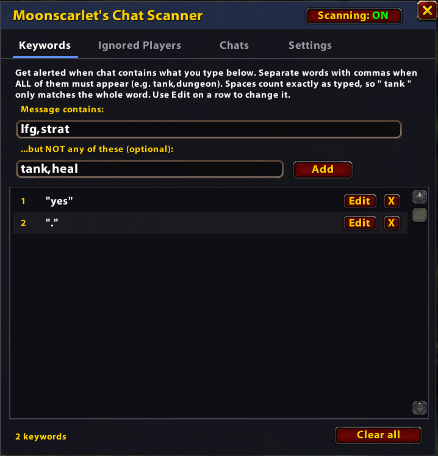
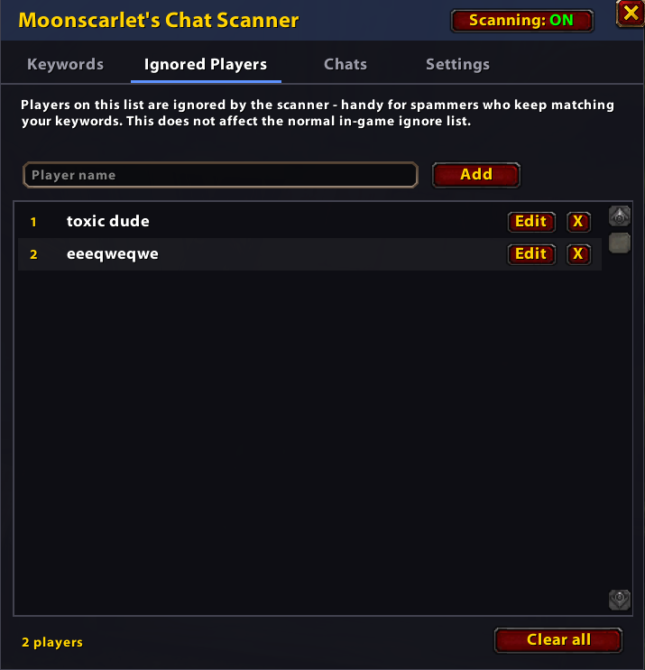
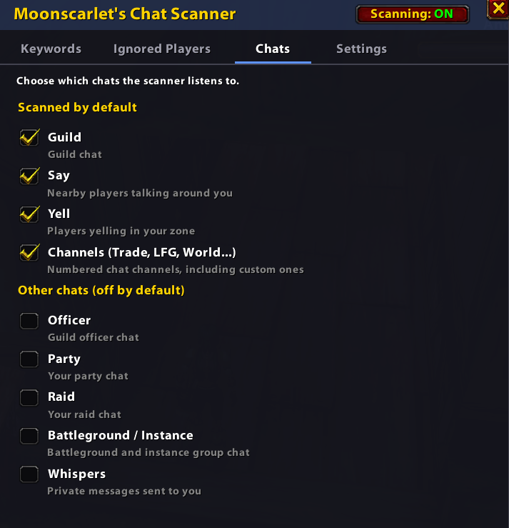
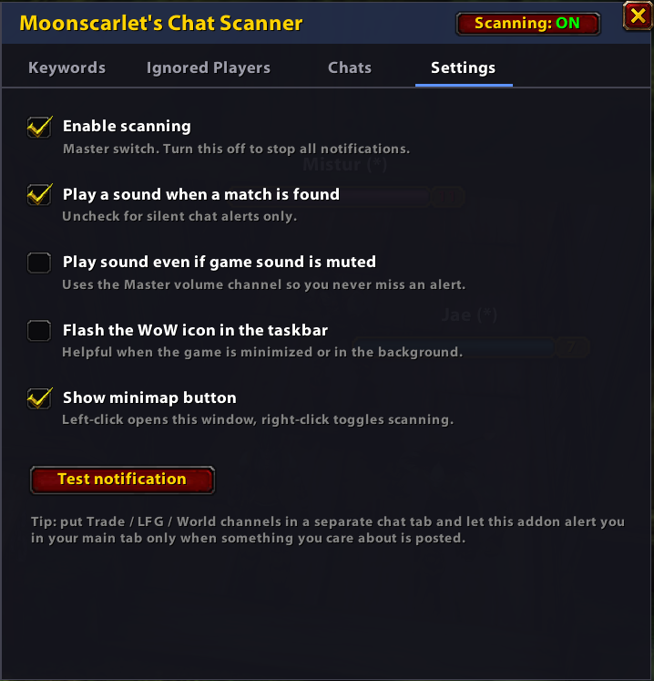

# Moonscarlet's Chat Scanner

A World of Warcraft addon that watches chat for the words you care about and alerts you when they appear. It works well with spammy channels like Trade, LFG and World.

## Features

- In-game window (`/cs` or the minimap button) with tabs for Keywords, Ignored Players, Chats and Settings
- Match words or phrases, require several words together, or exclude words
- Edit existing keywords in place
- Choose which chats are scanned:
  - **On by default:** Guild, Say, Yell, Channels
  - **Off by default:** Officer, Party, Raid, Battleground / Instance, Whispers
- Per-player ignore list (separate from the game's own ignore list)
- Sound alert (optional "play even if muted") and taskbar flash
- Clickable, class-colored player names in alerts
- Skips your own messages and duplicate messages
- Settings and lists are saved between sessions

## Installation

1. Download the latest release.
2. Extract the `MoonscarletsChatScanner` folder into `World of Warcraft/_<version>_/Interface/AddOns/`.
3. Restart the game or type `/reload`.

## Usage

Type `/cs` or click the minimap button, then:

1. Open the **Keywords** tab, type what you're looking for and press Enter.
2. Optionally fill in "...but NOT any of these" to skip unwanted messages.
3. Use the **Chats** tab to choose where to listen.

### Keyword rules

- Separate words with commas to require **all** of them: `tank,dungeon`
- Use the second box to exclude words: `gold,boost`
- Spaces count exactly as typed, so `" tank "` only matches the whole word.

### Slash commands

| Command | Description |
|---|---|
| `/cs` | Open or close the window |
| `/cs add [text]` | Add a keyword (`_` = space, `\|` = must match all, `-` = exclude) |
| `/cs del [number]` | Remove a keyword |
| `/cs clear` | Clear all keywords |
| `/cs list` | Print keywords and settings |
| `/cs addplayer [name]` | Ignore a player |
| `/cs delplayer [number]` | Stop ignoring a player |
| `/cs clearplayers` | Clear the ignore list |
| `/cs players` | Print ignored players |
| `/cs enable` / `/cs disable` | Turn scanning on or off |
| `/cs mute` | Toggle notification sound |
| `/cs master` | Play sound even if game sound is muted |
| `/cs flash` | Toggle taskbar flash |
| `/cs help` | Print all commands |

Examples: `/cs add dps|scholo`, `/cs add LFM_Molten_Core|-gold`

# Screenshot

